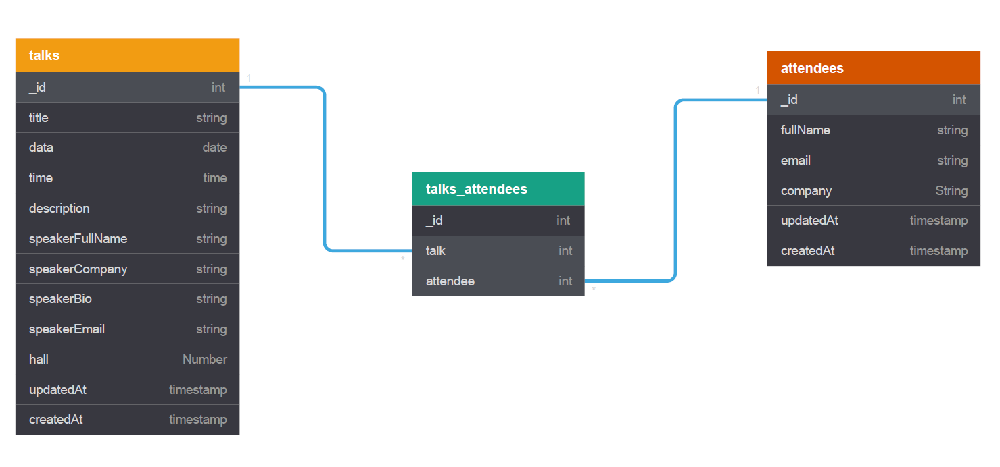

# IIC Management System

> This is a RESTful API for Intelligent Innovations Conference to manage their conferences.

## Features

- CRUD operations for talks and attendee
- Visitors can leave a comment
- Pagination and search where necessary
- API Security (NoSQL Injections, XSS Attacks, http param pollution etc)

## API Documentation

<!-- Hosted on netlify: [Blog API](https://blog-api-docs-77ae6a.netlify.com/) -->

Extensive and testing documentation with postman: [IIC API](https://documenter.getpostman.com/view/9407876/SWTD6vrb?version=latest)

## Database Model

Though the diagram uses sql data type, this diagram is to show you the various collections in the mongo database.



## Requirement

- NodeJS
- MongoDB

## Configuration File

Rename .env.example in config folder to .env then modify environment variables to suit your dev environment, but you don't need to though.

```ENV
NODE_ENV=development
PORT=4001

MONGO_URI=mongodb://localhost/IIC-managment-system
```

## Client

---

### Project setup

```
npm install
```

### Compiles and hot-reloads for development

```
npm run serve
```

### Compiles and minifies for production

```
npm run build
```

### Lints and fixes files

```
npm run lint
```

### Customize configuration

See [Configuration Reference](https://cli.vuejs.org/config/).

## Server

---

Change directory to the server folder

Install all npm dependecies

```console
npm install
```

Install nodemon globally

```console
npm install -g nodemon
```

Run database seeder

- Seeder folder is \_data/
- Edit the seeder file if you want to

```console
node seeder -i
```

Delete all data

```console
node seeder -d
```

## Start web server

---

```console
node run dev
```

## License

This project is licensed under the MIT License

## Developed by Reagan Ekhameye (Tech Reagan)

Reach me on twitter [@techreagan](https://www.twitter.com/techreagan)
